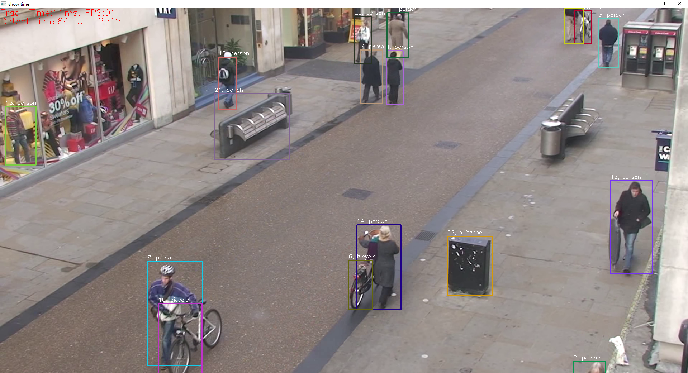

# 一个简单的实例追踪算法
# How to use
```python
# base基本使用
python main.py --video_path "./sample.mp4"

# 使用简单特征提取(快一点), faster
python main.py --video_path "./sample.mp4" --simple_extractor

# 指定需要追踪的类别, track special class by id
python main.py --video_path "./sample.mp4" --class_ids 0 1 2 3
```
觉得效果还可以的画,给个star吧, pls star it~
